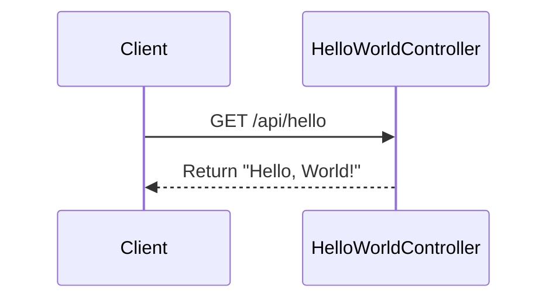
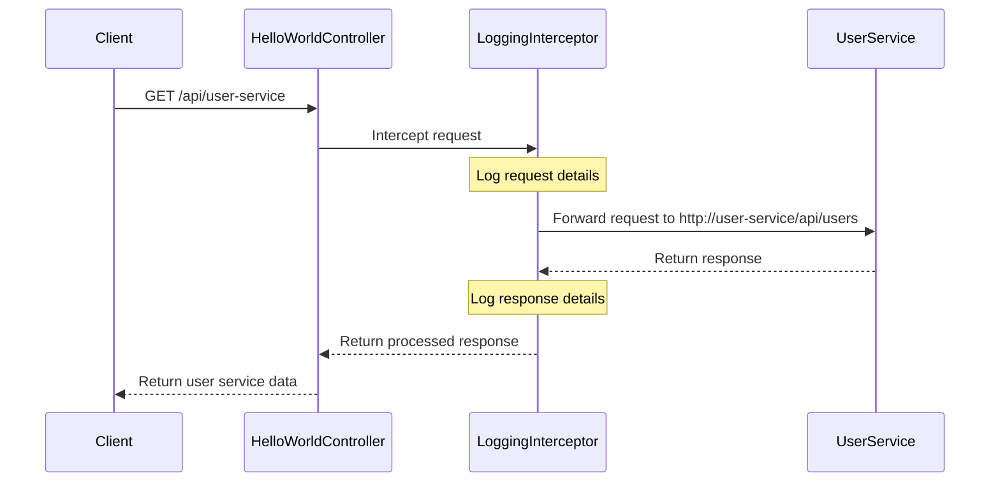
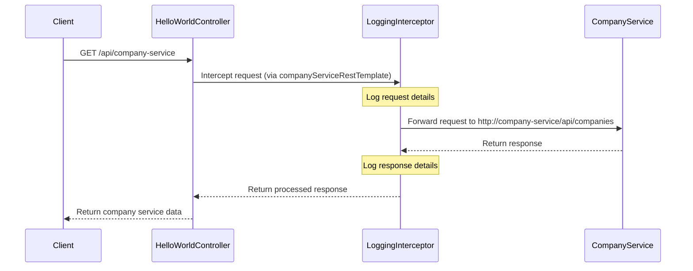
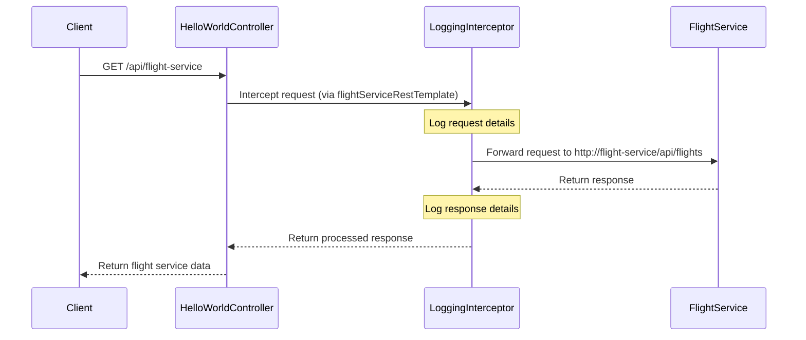
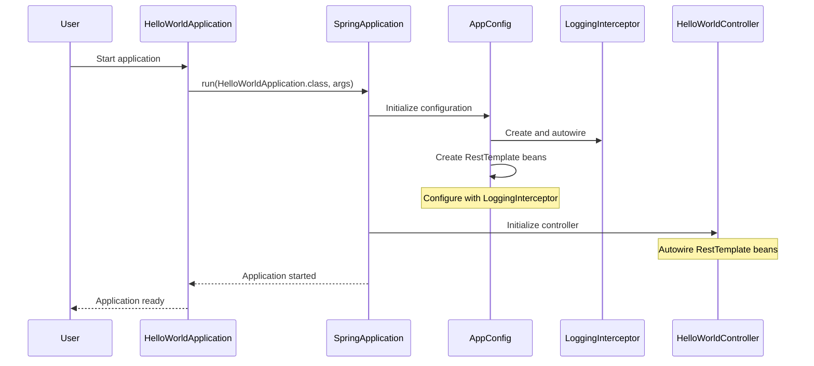

# Sequence Diagrams for APIs and Flows

## Overview
This document contains sequence diagrams for the API flows in the application. The application is a Spring Boot service that provides several REST endpoints and communicates with external services.

## 1. Basic Hello World API Flow

## 2. User Service API Flow

## 3. Company Service API Flow

## 4. Flight Service API Flow

## 5. Overall Application Initialization Flow

